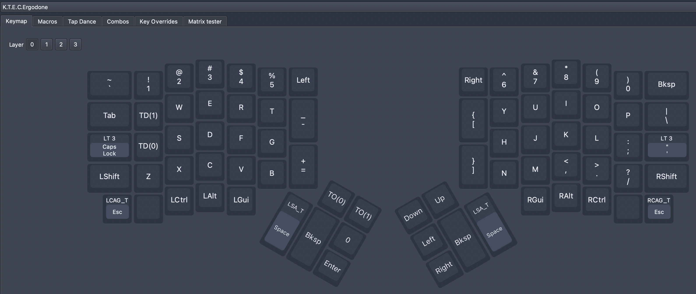
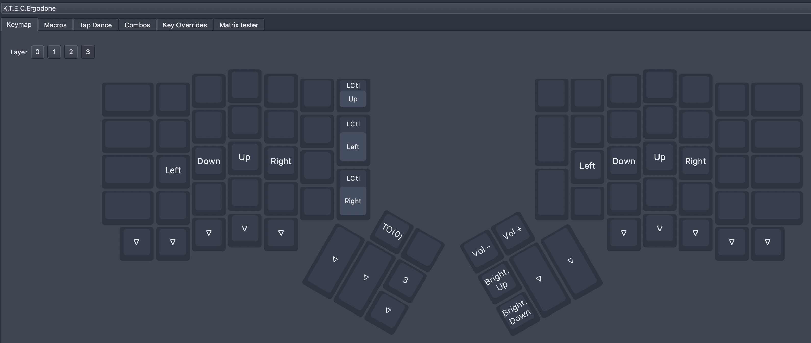

# 客制化键盘 ergodone

1. 早期版本的 ergodone 由于使用了 tmk 芯片， 芯片刷机工作模式为 hid bootloader, 需要使用 tkg-toolkit 来刷固件[链接](https://github.com/kairyu/tkg-toolkit.git)；
2. 刷固件的指令： ./hid_bootloader_cli -w -v -mmcu=atmega32u4 /Usrs/xxx/xxx/xxx/xxx.hex
3. 由于 ergodone 这样刷机比使用 QMK ToolBox 麻烦， 所以我自己用源码编译了 via 版本的固件， 可以使用 via 来改键。
4. 如果 via 改键过多，想恢复原来未改键的固件，可以按照上述方法刷回初始固件。
5. 我自己的另一款 ergodone, 使用的是 dfu 的刷机模式， 所以可以直接使用 QMK ToolBox 来刷固件，可以灵活的在 [ydkb](https://ydkb.io/) 制作自己的固件，脱离了对 via 的依赖。

   tkg 相关资料：

6. 配列编辑与查看： https://config.qmk.fm/#/ktec/ergodone/LAYOUT_ergodox
7. 转换 layout json 为 keymap.c [传送门](https://jhelvy.shinyapps.io/qmkjsonconverter/)
8. tkg 在线刷固件【注意作者有一个网盘分享的使用说明】： https://yang.tkg.io/
9. via 在线改键： [【传送门】](https://usevia.app/)
10. via 软件下载： [【传送门】](https://github.com/the-via/releases/releases)

感触： 如果再买入 ergodone 一定要问清如下几点：

1. 刷固件的方式【又称： 刷配列】
2. 轴体是否热插拔 【缺了热插拔，就丧失了一般的灵魂】
3. 如何改键， 是否开启了 via 【 注意：通过 ydkb 制作的固件，默认不开启 via, 所以以后还想体验 via 功能的话，最好问下作者，是否可以提供原始配列 .json 和 原始固件 .hex】
4. 是否支持 via, 或者 vial, 是否功能全开。

## 预置配列:

这三个 hex 主要是针对自己使用的 ergodone, 主控是 mcu32， ram 比较小。

- ergodone_on_use.hex 是使用 tkg 制作的一个固件，不支持 via 和 vial
- ktec_ergodone_viaste.hex 是使用 QMK 源码，自己制作的一个固件，支持 via, 有点小, 只占用了 %62 的 mcu 空间， via 改键的操作空间大一些
- ktec_ergodone_vial.hex
  > - 使用 [vial-qmk](https://github.com/vial-kb/vial-qmk/tree/vial) 制作的固件, 占用 87% 的 mcu 空间。
  > - 由于 mega32u4 芯片的空间只有 0x7000 byte, 所以固件阉割了, 参数: 4 Layer, 15 Macro, 4 Tap Dance, 4 Combos, 8 KeyOvrerrides

### 使用建议:

- ergodone_on_use.hex 可以忽略不计
- ktec_ergodone_viaste.hex 建议使用，因为改建的自定义空间大一些, vial 不满足使用的时候，可以用这个救急;
- ktec_ergodone_vial.hex 建议使用，虽然功能阉割了，但是 vial 是真的香, 如果确定 tapdance 和 combos 不够用的时候， 可以考虑临时刷 ktec_ergodone_viaste, 抽时间把自己用 vial 定义的功能，定义到代码中，重新做 vial 固件。

固件配列说明：

## Layer0:

- capslock 和 ' 按键，单击是常规的按键功能， 按下不放开的时候会临时开启 layer3.
- a 按键使用 tapdance + Macro 套娃， 按一下是 a; 按住不放开, 会触发 macOS 的 shift + control + command + 3 【快速截屏到粘贴板】
- q 按键使用 tapdance + Macro 套娃， 按一下是 q; 按住不放开,会触发 macOS 的 shift + command + 5 【高级截图】
- esc 和 space 按键都设置了一对， 对应都做了单击和长按的区别，用以作为高级的修饰键， 给用户自定义快捷键留出空间。

配列设计思路:

- 本人是 vim 重度依赖户， 所以专门在 layer3 将 asdf 和 hjkl 的键位修改为 方向键， 用于结合 layer0 的 capslock 定义的 LT3 功能，实现快速触发方向键
- 在 esc 和 space 定义 复杂组合键， 用以给自己留出定义高级快捷键的功能， 可以有效避开各类 app 的快捷键。
- 其中 space 的功能键 已经被 yabai 占用了大部分。

## Layer3:

这里 A S D F 变为了 方向键; H J K L 也变为了方向键，且和 vim 的方向操作习惯相同。

部分按钮禁用了，触发没有任何反应；可以使用 vial 开启

右手拇指部分配置了屏幕亮度和声音控制。
