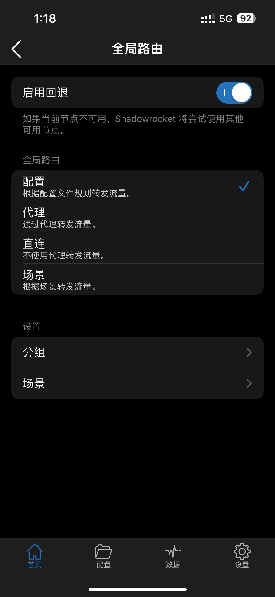
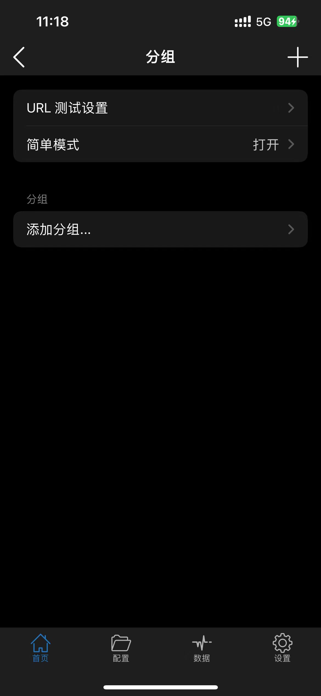
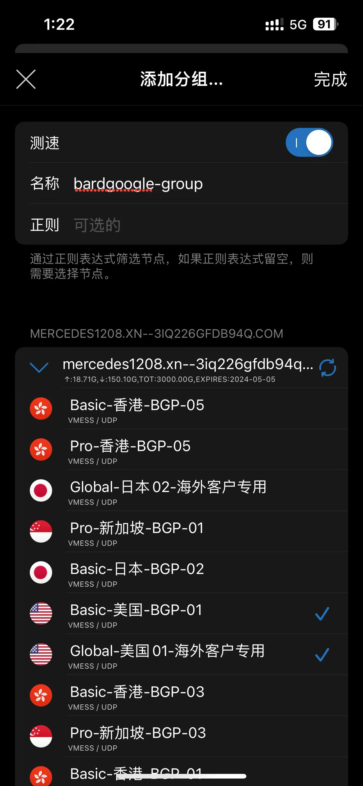
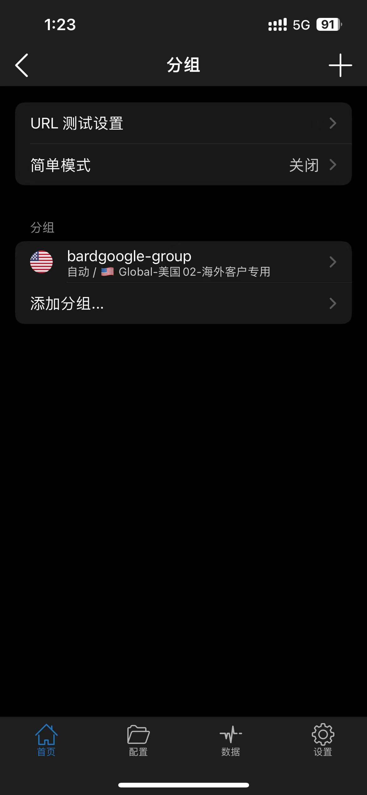
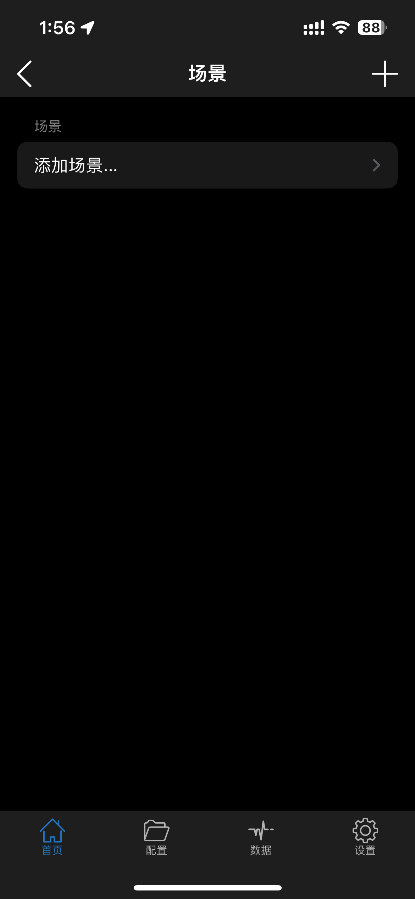
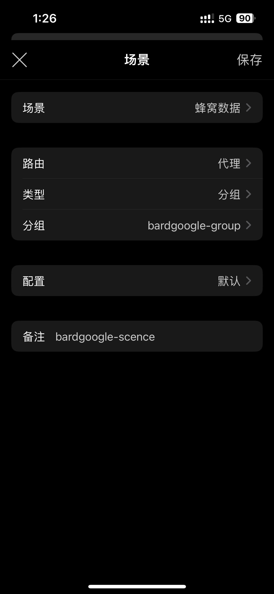
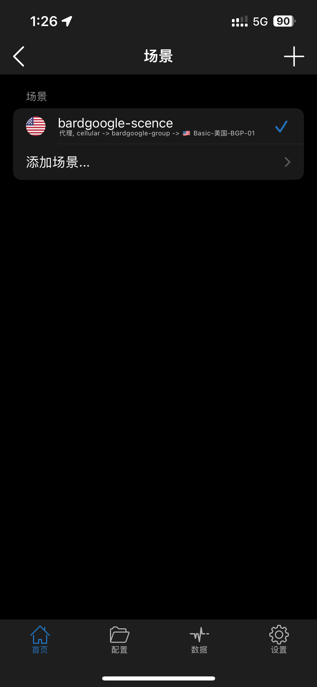
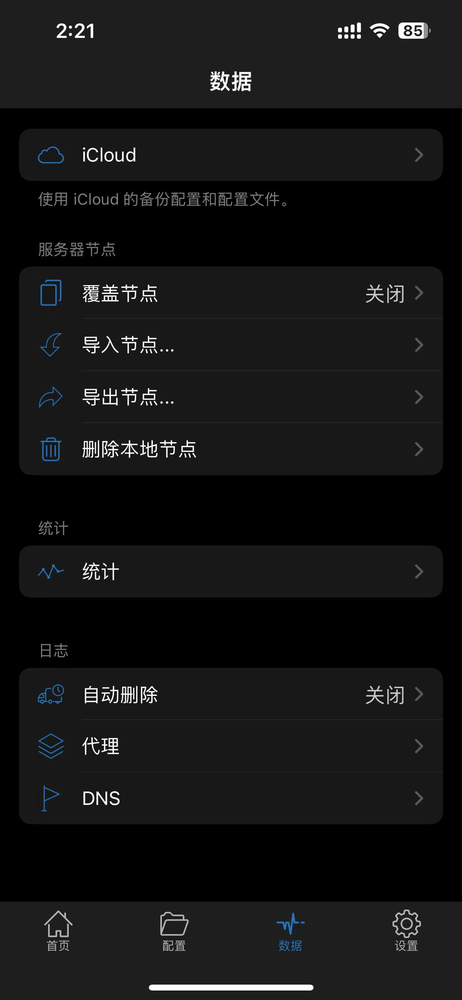
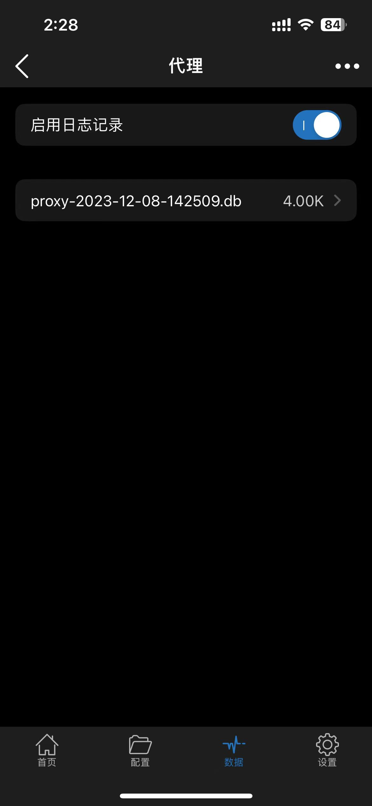

# 小火箭场景模式使用

## 配置分组

- 在首页tab,点击 全局路由, 进入全局路由界面

    

- 设置分组
    点击上图中 分组 选项，进入分组设置界面

    

- 添加分组

  - 点击上图中 添加分组 选项, 进入添加分组界面

  

  - 设置分组属性：
  
    - 要开启 测速
    - 给分组输入名称, 我输入的是 hardgoogle-group
    - 不要输入正则， 则此时可以手动选择节点
    - 选择所有目标节点， 我现在为了能够把流量转发到 米国 节点， 所以选择了所有的米国节点。

    配置分组属性后，效果如上图。

- 保存分组
  
  保存分组后，分组界面如下图所示：

  

## 添加场景

- 在首页tab,点击 全局路由, 进入全局路由界面

     

- 设置场景
  点击上图中 场景 选项，进入场景设置界面

  

- 添加场景
  
  - 点击上图中 添加场景 选项，进入添加场景界面
  
  

  - 配置场景属性：

    - 场景： 可选择此场景主要是针对 蜂窝数据，还是 无线局域网； 可以选择默认，我推测 默认 是对所有网络形式都生效， 没测试过。 但是 蜂窝数据/无限局域网 模式，是手机切换到这个网络模式的时候，会自动使用该场景。

    - 路由： 本场景的转发模式 配置/代理/直连。 我为了使用全米国节点， 我此处选择的是代理， 所有流量都会转发到米国节点。
    - 类型： 此处选择分组
    - 分组： 选择分组类型后， 会多出来一个分组选项， 在这里就可以选择 上一个小节 设置的分组
    - 配置:  这一项就不用改了，因为路由使用了全局代理方式的路由
    - 备注： 给场景设置备注， 其实就是场景的名字。
    - 配置场景属性后，保存场景

    添加场景后，场景界面如下图：

    

## 启用场景模式

- 在首页tab,点击 全局路由, 进入全局路由界面
- 点击 全局路由 选项，进入 全局路由 界面， 选择场景
- 此时就使用了场景模式， 在 全局路由 界面，点击 场景 选项， 可以看到当前是哪个场景生效。 如上图 hardgoogle-scene 右侧有一个 ✔︎ 号

此时，去浏览器浏览网址， 流量就会按照设置的场景模式，转发到 场景使用的分组中的节点。 我在演示时候，设置的分组中都是米国节点。所以此时流量都应该走到米国节点。

## 查看流量转发日志

- 小火箭首页， 选择 数据 tab

    

- 点击数据页面的 代理 选项, 进入 代理 页面。

    

- 启用日志记录右侧的开关打开。
- 回到手机主页， 打开系统浏览器， 浏览一个网址。
- 再回到小火箭的 数据 --> 代理 页面， 可以看到一个日志文件。
- 如果没有日志文件， 可以点击 代理 页面右上角的三个点，唤出 刷新 按钮。 刷新一下， 应该就可以看到日志文件了。 如果还是没有日志文件， 则说明浏览器没有产生流量， 不妨在浏览器中使用谷歌，搜索一个词条，有搜索结果后， 再回来查看是否有日志文件。