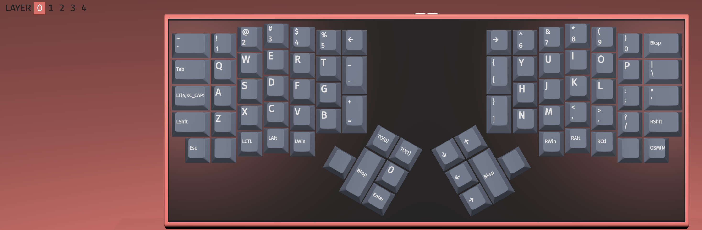
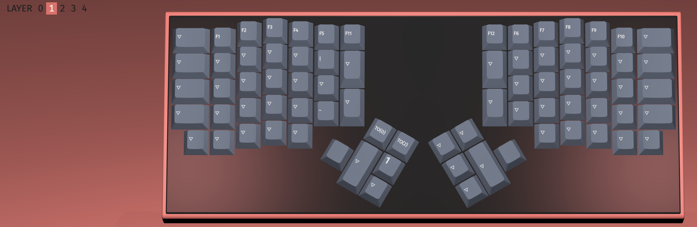
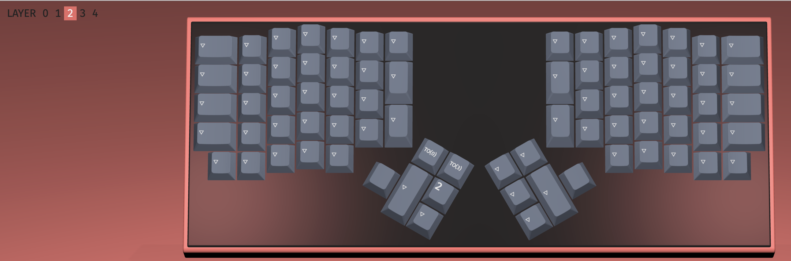
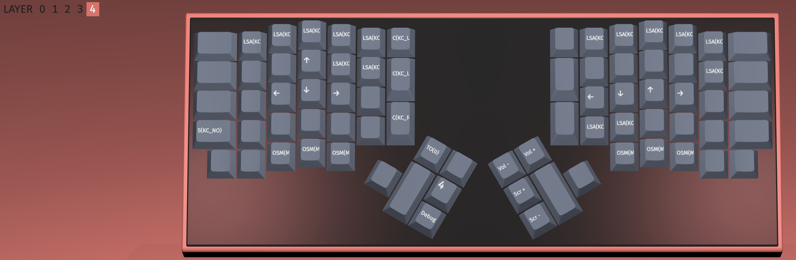

1. 早期版本的 ergodone 由于使用了 tmk 芯片， 芯片刷机工作模式为 hid bootloader, 需要使用 tkg-toolkit 来刷固件[链接](https://github.com/kairyu/tkg-toolkit.git)；
2. 刷固件的指令： ./hid_bootloader_cli -w -v -mmcu=atmega32u4 /Usrs/xxx/xxx/xxx/xxx.hex
3. 由于 ergodone 这样刷机比使用 QMK ToolBox 麻烦， 所以我自己用源码编译了 via 版本的固件， 可以使用 via 来改键。
4. 如果 via 改键过多，想恢复原来未改键的固件，可以按照上述方法刷回初始固件。
5. 我自己的另一款 ergodone, 使用的是 dfu 的刷机模式， 所以可以直接使用 QMK ToolBox 来刷固件，可以灵活的在 [ydkb](https://ydkb.io/) 制作自己的固件，脱离了对 via 的依赖。

tkg 相关资料：

1. 配列编辑与查看： https://config.qmk.fm/#/ktec/ergodone/LAYOUT_ergodox
2. tkg 在线刷固件【注意作者有一个网盘分享的使用说明】： https://yang.tkg.io/
3. via 在线改键： [【传送门】](https://usevia.app/)
4. via 软件下载： [【传送门】](https://github.com/the-via/releases/releases)

感触： 如果再买入 ergodone 一定要问清如下几点：

1. 刷固件的方式【又称： 刷配列】
2. 轴体是否热插拔 【缺了热插拔，就丧失了一般的灵魂】
3. 如何改键， 是否开启了 via 【 注意：通过 ydkb 制作的固件，默认不开启 via, 所以以后还想体验 via 功能的话，最好问下作者，是否可以提供原始配列 .json 和 原始固件 .hex】

固件配列说明：

**每一层在左手拇指，有三个特殊按钮： 快速切换到 Layer0， 切换到高一级 Layer， 输出当前 Layer 数字。**

Layer0:

其中 capslock 按键，单击是常规的 capslock 功能， 按下不放开的时候会临时开启 layer4.

在 Layer0, 触发组合键 capslock + HJKL 可以实现光标上下左右的移动， 这在文字输入的时候特别方便。

Layer1:

数字按键变为了 F 功能键，其他按键穿透到 Layer0

Layer2-3:

备用层级， 配件穿透到 Layer0

Layer4:

系统控制层级， 这里 E S D F 变为了 方向键; H J K L 也变为了方向键，且和 vim 的方向操作习惯相同。

部分按钮禁用了，触发没有任何反应；

也有部分按钮设置为了组合键， 主要是适配个人 mac 电脑配置的 yaibai + skhd 实现的桌面管理组合键。

右手拇指部分配置了屏幕亮度和声音控制。
